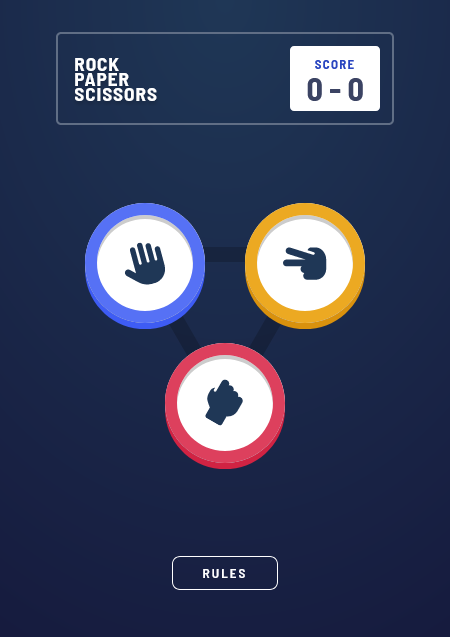

# Frontend Mentor - Rock, Paper, Scissors game

This is a solution to the [Rock, Paper, Scissors game challenge on Frontend Mentor](https://www.frontendmentor.io/challenges/rock-paper-scissors-game-pTgwgvgH). I started out with the rock-paper-scissors game project on The Odin Project and used the design on Frontend Mentor for the UI. I also followed along with the instructions on The Odin Project to learn branching in Git.

## Table of contents

- [Overview](#overview)
  - [The challenge](#the-challenge)
  - [Screenshot](#screenshot)
  - [Links](#links)
- [My process](#my-process)
  - [Built with](#built-with)
  - [What I learned](#what-i-learned)
  - [Continued development](#continued-development)
  - [Useful resources](#useful-resources)

## Overview

### The challenge

Users should be able to:

- View the optimal layout for the game depending on their device's screen size
- Play Rock, Paper, Scissors against the computer
- See hover and focus states for all interactive elements on the page
- View the rules after clicking on the RULES button

### Screenshot



### Links

- [View Code](https://github.com/elizerdim/rock-paper-scissors)
- [Live Preview](https://elizerdim.github.io/rock-paper-scissors/)

## My process

### Built with

- Semantic HTML5 markup
- CSS custom properties
- Flexbox
- Grid
- Mobile-first workflow
- JavaScript

### What I learned

- After a lot of research and deliberation, I decided to use the following media rule for hover states. Apparently, there are some Samsung mobile devices that apply the hover states when only (hover: hover) is used, which is not ideal, so I added (min-width: 500px) to eliminate them. There are also touch devices with an added input mechanism, so I decided I should use (pointer: fine), which checks if the primary pointer is fine and eliminates touch devices.  

```css
@media (hover: hover) and (pointer: fine) and (min-width: 500px) {}
```

- This is the first project where I used this much JS code, so this was a great opportunity to solidify my vanilla JavaScript skills. I encountered many errors, which I solved with console.log() during development, and I feel I got a good grasp of objects, HTML elements as objects, event objects, node lists, etc. 

- I wanted to use a regular expression to remove some class names that get added while playing the game, and I quickly realized that I had to use className.replace() instead of classList.remove(), and I had to assign the new value to the className property of the element. 

```js
document.querySelector(".loading").classList.remove("hidden");
```
vs.
```js
const regx = new RegExp(/(rock|paper|scissors)/, 'g');

document.querySelector(".result__choice--user").className = document.querySelector(".result__choice--user").className.replace(regx, '');
```

- I used branching in git for the first time in this project, and I learned about commands such as git branch, git checkout, git checkout -b, git push origin, and git merge.

- I learned about "description" meta tag for better SEO and used it in this project.

- I used grid-template-areas for the first time in a project.

```css
.rules__description {
  display: grid;
  grid-template-columns: repeat(5, auto);
  grid-template-rows: repeat(3, auto) repeat(2, 1fr);
  grid-template-areas:
    "p p a1 s s"
    "p p a1 s s"
    "a2 a2 . a3 a3"
    ". r r r ."
    ". r r r .";
  width: 280px;
  margin: 0 auto;
}
```

### Continued development

I noticed that I could have written much cleaner JS code after I finished the project, so I look forward to doing that future projects. I also think that this project has given me a lot of opportunities to practice vanilla JS, so I feel ready to move on to React in future projects.

### Useful resources

- [CSS triangle](https://stackoverflow.com/a/56484262) - I used this stackoverflow answer to draw the triangle in the background.
- [LOVE and HATE](https://css-tricks.com/remember-selectors-with-love-and-hate/) - The order of pseudo-classes :link, :visited, :hover, and :active matter and this article provides a nice way to remember the correct order.
- [Loading Animations](https://loading.io/css/) - Open source CSS loading animations.